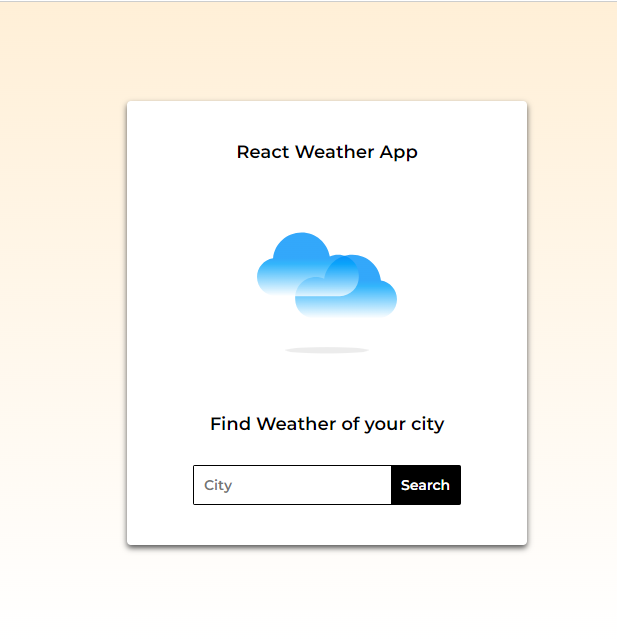
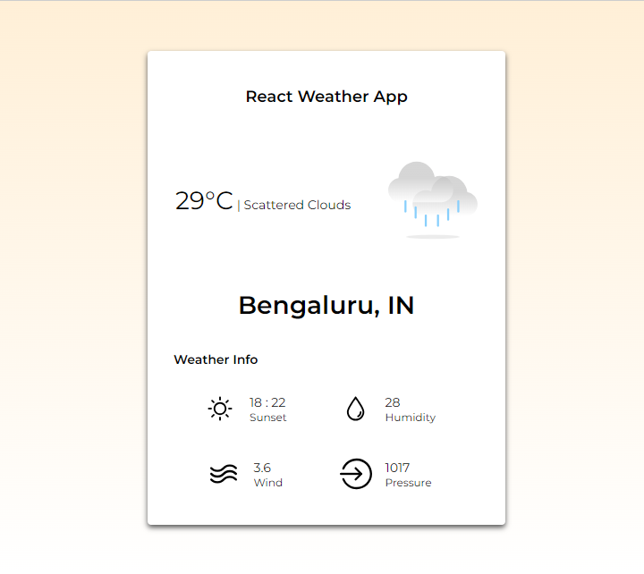
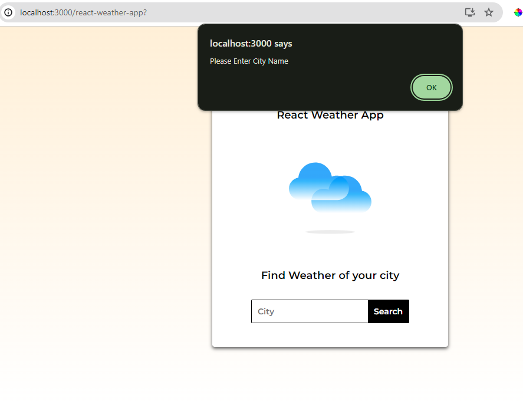
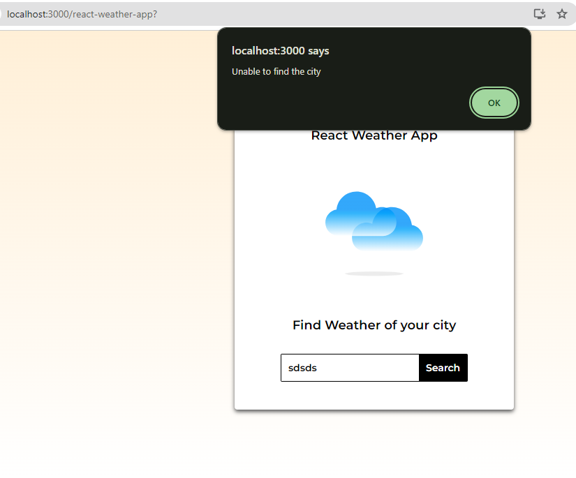

# React Weather App - ReactJS Projects

## Screenshots :
1. Find City:

2. Weather Info:

3. EnterCity:

4. Unable to find City:

### APIs Used
[Open Weather APIs](https://openweathermap.org/)

https://openweathermap.org/current

### API Info
* Method: `GET`
* URL: `https://api.openweathermap.org/data/2.5/weather?q={CITY_NAME}&appid={API_KEY}`

### Libraries used
* `styled-components`
* `axios`
* `react-scripts`
